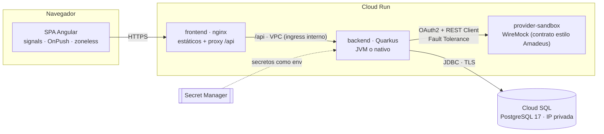
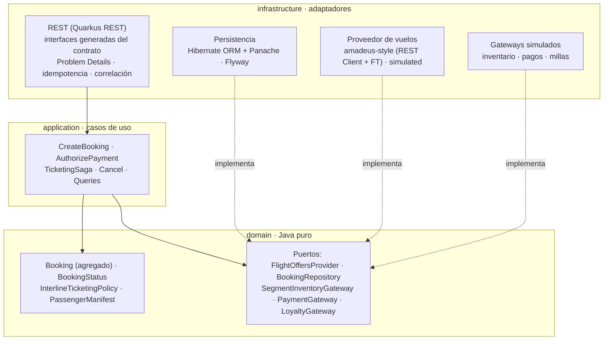
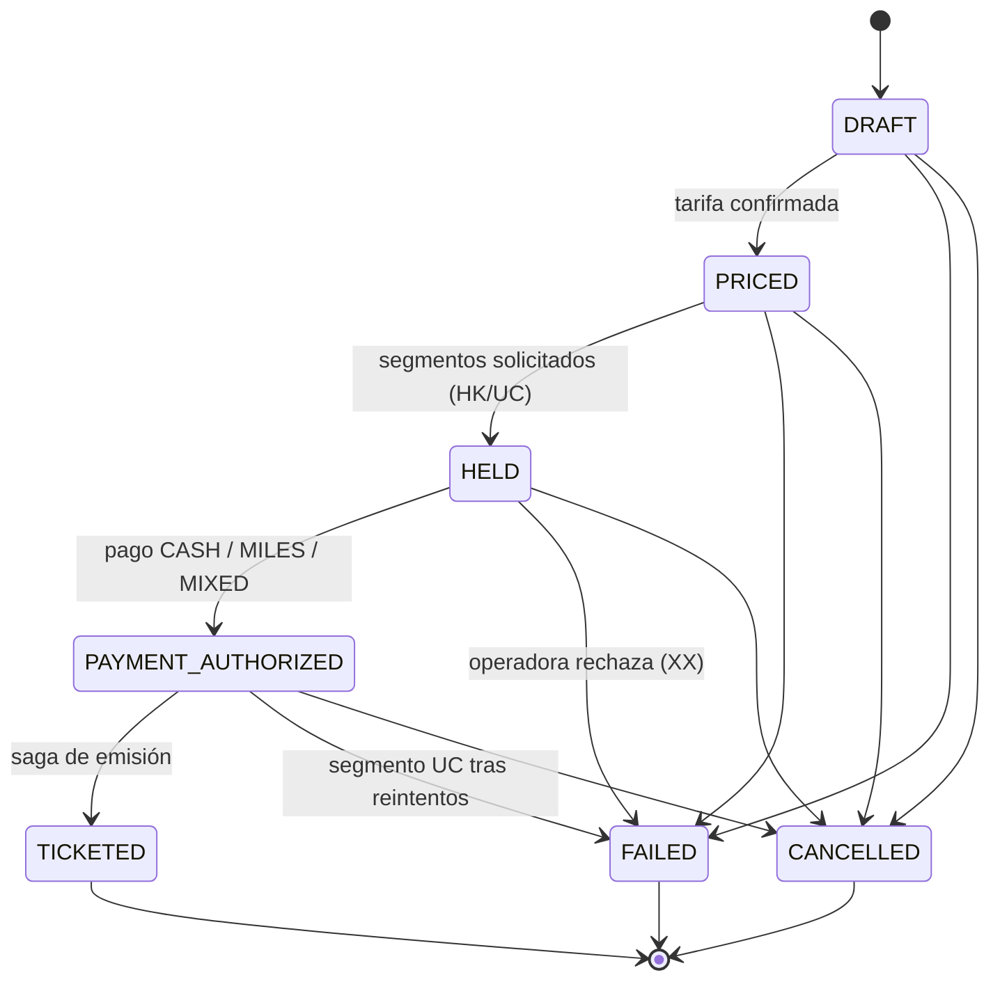
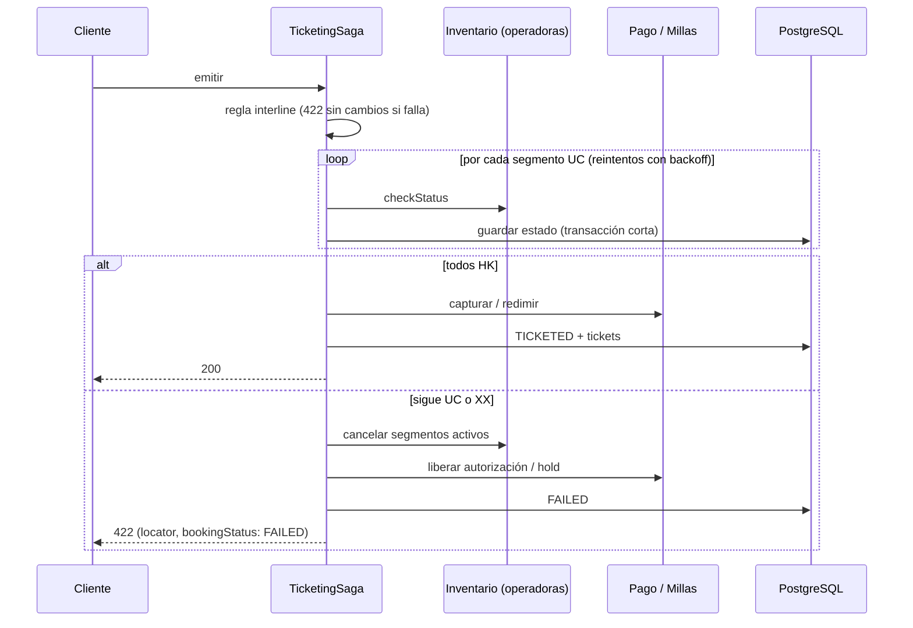

# Interline Booking Manager

Gestión de reservas con itinerarios de varias aerolíneas emitidos en **un solo ticket**
(*interline*), inspirada en las plataformas white-label que usan las aerolíneas para vender en
su propia marca.

**Quarkus 3.40 LTS (Java 21) · Angular 22 · PostgreSQL 17 · Cloud Run · Terraform · GitHub Actions**

- **Regla central:** solo se emite un ticket único si la aerolínea validadora tiene acuerdo
  interline con todas las operadoras.
- **Saga orquestada con compensación:** si un segmento sigue sin confirmar (UC) tras los
  reintentos, se cancelan los segmentos, se libera el pago o el hold de millas y la reserva
  pasa a `FAILED`.
- **Contract-first:** un contrato OpenAPI del que salen las interfaces JAX-RS del backend y los
  tipos TypeScript del frontend.
- **Proveedor de vuelos estilo Amadeus** servido por WireMock, con resiliencia completa
  (timeout, retry con backoff, circuit breaker y fallback).
- **White-label en runtime:** colores, logo y nombre por aerolínea desde un JSON, sin
  recompilar.

> Datos de demostración: aerolíneas, vuelos, tarifas y acuerdos interline son **ficticios**.
> Las marcas del frontend («Aerolíneas Cóndor», «Pacífico Air») son inventadas.

## Arquitectura

### Sistema



En local, `docker compose` levanta lo mismo: nginx → Quarkus → PostgreSQL, con WireMock como
proveedor.

### Backend hexagonal



ArchUnit hace cumplir estas reglas en cada build:

- el dominio no importa Jakarta, Quarkus, Hibernate ni Jackson;
- no hay ciclos entre paquetes;
- los DTO no salen del adaptador REST;
- las entidades JPA no salen de infraestructura.

### Máquina de estados de la reserva



### Saga de emisión (`POST /bookings/{locator}/ticket`)



- Cada paso es idempotente y el estado de la saga es el propio agregado: si el proceso cae,
  basta con repetir la petición.
- Las llamadas externas nunca se hacen dentro de una transacción de base de datos.

## Estructura del repositorio

```
api/            Contrato OpenAPI 3.0.3 (fuente única) + config de Redocly
backend/        Quarkus · domain / application / infrastructure · Dockerfile (JVM) · Dockerfile.native
frontend/       Angular · flujo por pasos · gestión · white-label · Dockerfile (nginx) · e2e Playwright
wiremock/       Contrato estilo Amadeus (mappings + __files) · Dockerfile del sandbox
infra/          Terraform: bootstrap (WIF, state, cuentas de CI) y app (VPC, Cloud SQL, Cloud Run...)
.github/        Workflows ci.yml (build/test/análisis/imágenes/deploy) e infra.yml (plan/apply)
docs/adr/       Decisiones de arquitectura, una por fase
```

## Cómo correr en local

### Todo en Docker (solo hace falta Docker)

```bash
cp .env.example .env
docker compose up --build
# Frontend http://localhost:4200 (?tenant=LA para el otro tema) · Swagger http://localhost:8080/swagger-ui

docker compose --profile observability up --build                        # + Jaeger en :16686
BACKEND_DOCKERFILE=backend/Dockerfile.native docker compose up --build   # backend nativo (~10 min, ~6 GB RAM)
E2E_BASE_URL=http://localhost:4200 npm --prefix frontend run e2e         # e2e contra el stack
```

### Desarrollo (Java 21, Node 24.15 y Docker)

```bash
cd backend && ./mvnw quarkus:dev
# Dev Services levanta PostgreSQL y WireMock. Recarga en caliente, Dev UI en /q/dev-ui,
# pruebas continuas pulsando "r".

cd frontend && npm ci && npm start          # http://localhost:4200 (proxy /api → :8080)
```

### Pruebas

```bash
cd backend  && ./mvnw verify       # 181: dominio, ArchUnit, @QuarkusTest (Dev Services), WireMock, resiliencia
cd frontend && npm run test:ci     # 43: store, validadores, interceptors, reparto del pago mixto
cd frontend && npm run e2e         # 3: Playwright, flujo feliz completo contra el stack real
terraform -chdir=infra/terraform/app init -backend=false && terraform -chdir=infra/terraform/app test   # 5 (mocks)
```

### Probar la saga con compensación

```bash
cd backend && ./mvnw quarkus:dev '-D%dev.app.simulated.inventory.never-confirm-carriers=IB'
# Reserva BOG → FCO (AV + IB), paga y emite → 422 SEGMENT_NOT_CONFIRMED, reserva FAILED,
# segmentos XX y pago RELEASED.
# El prefijo %dev limita el fallo simulado al perfil dev: las pruebas continuas (tecla "r")
# corren en la misma JVM con el perfil test y siguen viendo que IB confirma. Sin el prefijo,
# la propiedad de sistema se aplica también a ellas y el flujo feliz falla.
```

### Flujo con `curl`

```bash
OFFER=$(curl -s localhost:8080/api/v1/offers/search -H 'Content-Type: application/json' \
  -d '{"origin":"BOG","destination":"FCO","departureDate":"2026-12-15","passengers":{"adults":1}}' \
  | jq -r '.offers[0].offerId')

LOC=$(curl -s localhost:8080/api/v1/bookings -H 'Content-Type: application/json' \
  -H "Idempotency-Key: $(uuidgen)" \
  -d "{\"offerId\":\"$OFFER\",\"contact\":{\"email\":\"ana@example.com\"},
       \"passengers\":[{\"ref\":\"P1\",\"type\":\"ADT\",\"firstName\":\"Ana\",\"lastName\":\"Pérez\",\"dateOfBirth\":\"1990-04-12\"}]}" \
  | jq -r .locator)

AMOUNT=$(curl -s localhost:8080/api/v1/bookings/$LOC | jq .fare.total.amount)
curl -s localhost:8080/api/v1/bookings/$LOC/payments -H 'Content-Type: application/json' \
  -H "Idempotency-Key: $(uuidgen)" -d "{\"method\":\"CASH\",\"cash\":{\"amount\":$AMOUNT,\"currency\":\"USD\"}}" | jq .status
curl -s -X POST localhost:8080/api/v1/bookings/$LOC/ticket | jq '{status, tickets}'
```

## Cómo desplegar en GCP

La guía completa está en **[infra/README.md](infra/README.md)**. En resumen:

1. `infra/terraform/bootstrap` (una vez, a mano): APIs, bucket del state, Workload Identity
   Federation y cuentas de CI.
2. Cargar las credenciales del proveedor con `gcloud secrets versions add ... --data-file=-`.
3. Crear en GitHub las **variables** que devuelve el bootstrap y los environments
   `infrastructure` y `production` con aprobación.
4. Push a `main`. `infra.yml` aplica `infra/terraform/app` (VPC, Cloud SQL privado, Secret
   Manager, Artifact Registry y Cloud Run) y `ci.yml` construye, prueba, analiza, publica y
   despliega.

**Sin secretos:**

- la autenticación es por Workload Identity Federation (sin llaves JSON ni GitHub secrets);
- la contraseña de la base de datos se genera como valor efímero y se escribe con argumentos
  write-only, así que **no está en el state**, y `terraform test` lo comprueba;
- el backend no es accesible desde internet: solo el frontend lo alcanza, por la VPC.

### CI/CD

| Workflow | Disparo | Qué hace |
| --- | --- | --- |
| `ci.yml` | PR, push, manual | Contrato · backend · frontend (incluida la deriva de tipos) · actionlint · hadolint · terraform fmt/validate/test · tflint · Trivy (IaC e imágenes) · CodeQL · build de imágenes · **e2e contra docker compose** · en `main`: push a Artifact Registry, despliegue y smoke test. Con `backend_variant: native`, backend nativo |
| `infra.yml` | PR / push en `infra/` | `terraform plan` (solo lectura) en PR; `plan` + `apply` con aprobación en `main` |
| `dependabot.yml` | semanal | Acciones, Maven, npm, imágenes base y providers |

## Decisiones (ADR)

| ADR | Fase |
| --- | --- |
| [0001](docs/adr/0001-fase-1-estructura-contrato-dominio.md) | Monorepo, contract-first, dominio y máquina de estados |
| [0002](docs/adr/0002-fase-2-persistencia-casos-de-uso-saga.md) | Persistencia, transacciones cortas, saga, idempotencia y Problem Details |
| [0003](docs/adr/0003-fase-3-proveedor-estilo-amadeus.md) | Proveedor estilo Amadeus, WireMock, Fault Tolerance, hilos virtuales y Mutiny |
| [0004](docs/adr/0004-fase-4-frontend-angular.md) | Angular: signal stores, guards, formularios, interceptors y white-label |
| [0005](docs/adr/0005-fase-5-docker-compose.md) | Imágenes distroless, nativo, nginx y docker-compose |
| [0006](docs/adr/0006-fase-6-gcp-terraform-cicd.md) | GCP con Terraform, WIF y pipeline |

## Quarkus para desarrolladores Spring

Lo aprendido construyendo este proyecto viniendo de muchos años con Spring Boot.

### Equivalencias que se usan en el código

| Spring Boot | Quarkus | Dónde verlo |
| --- | --- | --- |
| `@Service`, `@Component`, `@Repository` | `@ApplicationScoped` (CDI). Los recursos REST son `@Singleton` por defecto | casos de uso en `application/` |
| `@Configuration` + `@Bean` | métodos `@Produces` en cualquier bean | `DomainServicesProducer` |
| `@Qualifier` / `@ConditionalOnProperty` | `@Identifier` + productor que elige en runtime; `@IfBuildProperty` existe pero se evalúa **al compilar** | `FlightOffersProviderProducer` |
| `application-dev.yml`, `spring.profiles.active` | **un solo** `application.properties` con prefijos `%dev.`, `%test.`, `%prod.` (y combinados: `%dev,test.`) | `application.properties` |
| `@ConfigurationProperties` | `@ConfigMapping` (una interfaz; SmallRye genera la implementación y valida al arrancar) | `SagaConfig`, `AmadeusStyleConfig` |
| `JpaRepository` | `PanacheRepositoryBase<Entity, Id>`, sin consultas derivadas por nombre; HQL abreviado (`find("locator", x)`) | `*PanacheRepository` |
| `@RestController` | interfaz JAX-RS (aquí generada del contrato) + clase que la implementa | `BookingsResource` |
| `@RestControllerAdvice` + `@ExceptionHandler` | `@ServerExceptionMapper` | `ProblemExceptionMappers` |
| `OncePerRequestFilter` | `@ServerRequestFilter` / `@ServerResponseFilter` | `CorrelationIdFilter` |
| OpenFeign / `@HttpExchange` | MicroProfile REST Client (`@RegisterRestClient`) | `AmadeusFlightOffersClient` |
| Resilience4j | MicroProfile Fault Tolerance (`@Timeout`, `@Retry`, `@CircuitBreaker`, `@Fallback`) | `AmadeusStyleFlightOffersProvider` |
| `TransactionTemplate` (`REQUIRES_NEW`) | `QuarkusTransaction.requiringNew().call(...)` | `BookingTransactions` |
| `spring.flyway.*` + `ddl-auto=validate` | `quarkus.flyway.migrate-at-start` + `schema-management.strategy=validate` | `application.properties` |
| Testcontainers + `@ServiceConnection` | **Dev Services**: PostgreSQL y WireMock arrancan solos en dev y test, sin configuración | todas las `@QuarkusTest` |
| `@SpringBootTest` | `@QuarkusTest` (una sola app para todas las clases de prueba) | `BookingFlowTest` |
| `@MockitoBean` | `@InjectMock` | `TicketingSagaCompensationTest` |
| springdoc | SmallRye OpenAPI, sirviendo aquí el contrato estático tal cual | `/openapi`, `/swagger-ui` |
| Actuator | SmallRye Health (`/q/health/live`, `/ready`, `/started`) + Micrometer (`/q/metrics`) | |
| `spring.threads.virtual.enabled` | `@RunOnVirtualThread` por endpoint | `OffersResource` |
| Spring Native / AOT `RuntimeHints` | `@RegisterForReflection` | `RestNativeReflectionConfig` |

### Lo que más cambia la forma de pensar

1. **La inyección se resuelve al compilar** (ArC). Los errores de cableado (bean ambiguo o
   inexistente) aparecen en el build, no al arrancar. La contrapartida: hay menos magia en
   runtime, y cosas como `@ConditionalOnProperty` se convierten en una decisión explícita
   entre build time y runtime.
2. **Los beans normal-scoped se inyectan a través de un *client proxy***. Para comprobar el
   tipo real en una prueba hay que hacer `ClientProxy.unwrap(...)`. Es el equivalente a los
   proxies CGLIB de Spring, pero siempre presente.
3. **Dev Services cambia el ciclo de desarrollo.** `./mvnw quarkus:dev` con Docker levanta la
   base de datos y los mocks de terceros. No hay `docker-compose` de desarrollo ni H2, y las
   pruebas corren contra el PostgreSQL real.
4. **Un solo archivo de configuración con perfiles** es más fácil de auditar que varios YAML.
   Las variables de entorno sobrescriben cualquier clave
   (`QUARKUS_LOG_CONSOLE_JSON_LOG_FORMAT=gcp`).
5. **Imperativo en hilos virtuales o reactivo con Mutiny.** Quarkus permite las dos cosas en
   el mismo proyecto:
   - para flujos secuenciales de I/O bastan los hilos virtuales, con código igual que en
     Spring MVC;
   - Mutiny compensa al componer I/O en paralelo, hacer streaming o cuando toda la cadena ya
     es reactiva.

   Cuidado con `synchronized` alrededor de I/O en Java 21: ancla el hilo virtual. Aquí se usa
   `ReentrantLock`.
6. **El nativo exige pensar en reflexión.** El fallo más sutil del proyecto solo ocurría en el
   ejecutable nativo: los recursos devuelven `Response`, Quarkus no sabía qué DTO se
   serializaban y Jackson perdía campos (`code`, `detail`, `fare`…). La solución fue anotar
   los DTO generados y añadir una prueba JVM que lo detecta en milisegundos. A cambio, el
   nativo arranca en **0,2 s** con unos **40 MiB**.
7. **`QuarkusTransaction` hace evidentes las transacciones programáticas.** En la saga, cada
   paso es una transacción corta y las llamadas a terceros quedan fuera, algo que en Spring
   suele esconderse detrás de `@Transactional` en el método equivocado.
8. **Los mappers de excepciones con tipos sellados de Java 21** (`switch` exhaustivo) dan una
   tabla de errores HTTP que el compilador mantiene al día.
9. **Fault Tolerance es configurable sin recompilar**
   (`quarkus.fault-tolerance."<clase>/<método>".*`), y el circuit breaker con nombre se
   inspecciona y resetea con `CircuitBreakerMaintenance`, muy útil en pruebas.
10. **Pequeñas trampas:**
    - JAX-RS responde **404** si no puede convertir un `@QueryParam` (un enum inválido): hubo
      que mapearlo a 400;
    - en distroless (sin locale) hace falta `-Dstdout.encoding=UTF-8` para que los logs no
      muestren «rechaz?»;
    - `mvnw` sin `unzip` descarga el `.tar.gz` y su checksum (el del `.zip`) falla;
    - el Mandrel por defecto de Quarkus 3.40 es JDK 25, aunque el proyecto sea Java 21.

## Estado y pendientes

Verificado en el entorno de desarrollo:

- todas las pruebas;
- docker compose + e2e (JVM y nativo);
- Terraform `validate`/`test`, tflint y Trivy;
- actionlint y hadolint.

No verificado: `apply` real en GCP, ejecución en GitHub Actions y build con Mandrel (registro
bloqueado en ese entorno).

Pendiente:

- trazas a Cloud Trace y Managed Prometheus;
- dominio propio con balanceador y Cloud Armor;
- activar OIDC con un IdP;
- i18n y modo oscuro en el frontend;
- limpieza programada de ofertas y claves de idempotencia caducadas.
