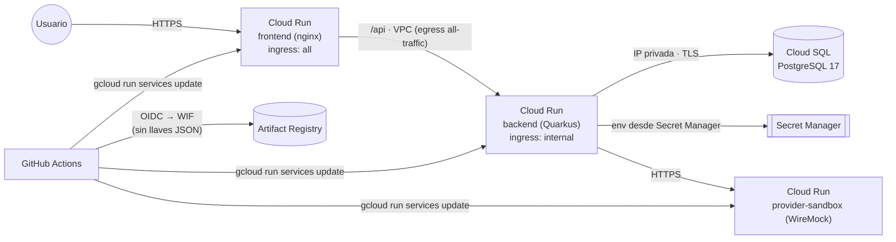

# Infraestructura en GCP (Terraform)

Dos stacks:

| Stack | Quién lo aplica | Qué crea |
| --- | --- | --- |
| [`terraform/bootstrap`](terraform/bootstrap) | Una persona con rol Owner, **una vez** | APIs, bucket del state (versionado), Workload Identity Federation para GitHub, cuentas de CI (`gh-deployer`, `gh-terraform`, `gh-terraform-plan`), contenedores de secretos externos |
| [`terraform/app`](terraform/app) | CI (`infra.yml`) desde `main`, con aprobación | VPC + Private Services Access, Cloud SQL PostgreSQL 17 (solo IP privada), Secret Manager, Artifact Registry, cuentas de runtime, Cloud Run (frontend, backend, sandbox del proveedor) |



## Secretos: nada en el repositorio ni en el state

- **Contraseña de la base de datos:** se genera con `ephemeral "random_password"` y se escribe
  con los argumentos *write-only* `secret_data_wo` (Secret Manager) y `password_wo` (Cloud SQL).
  Ni el plan ni el state la contienen; `terraform test` lo verifica (`secret_data == null`).
  Rotación: incrementar `db_password_version` y desplegar una revisión nueva del backend.
- **Credenciales del proveedor de vuelos:** Terraform solo crea el *contenedor* del secreto; el
  valor se carga una vez con `gcloud` (abajo) y nunca pasa por Terraform.
- **CI:** Workload Identity Federation. GitHub no guarda ningún secreto: solo *variables*
  con identificadores (proyecto, proveedor WIF, emails de las cuentas).
- Cloud Run inyecta los secretos como variables de entorno (`secret_key_ref`), leídas con la
  identidad del servicio, que solo tiene `secretAccessor` sobre **sus** secretos.

## Puesta en marcha (una vez)

Requisitos: `gcloud`, Terraform ≥ 1.11 y un proyecto de GCP con facturación.

```bash
gcloud auth application-default login

# 1. Bootstrap (state local; no contiene secretos)
cd infra/terraform/bootstrap
cp terraform.tfvars.example terraform.tfvars      # editar project_id y github_repository
terraform init && terraform apply
terraform output github_variables                 # → variables del repositorio en GitHub

# 2. Credenciales del proveedor (para el sandbox valen las de los stubs; con un proveedor real,
#    las suyas). Se leen de stdin: no quedan en el historial de la shell ni en ningún archivo.
printf '%s' 'interline-dev'        | gcloud secrets versions add amadeus-client-id     --data-file=-
printf '%s' 'interline-dev-secret' | gcloud secrets versions add amadeus-client-secret --data-file=-
```

3. En GitHub (**Settings → Secrets and variables → Actions → Variables**) crea las variables de
   `github_variables` (`GCP_PROJECT_ID`, `GCP_REGION`, `GCP_WIF_PROVIDER`, `GCP_DEPLOYER_SA`,
   `GCP_TERRAFORM_SA`, `GCP_TERRAFORM_PLAN_SA`, `GCP_TF_STATE_BUCKET`) y, opcionalmente,
   `GCP_ENVIRONMENT` (por defecto `prod`).
4. Crea los *environments* `infrastructure` y `production` con *required reviewers* y protege
   la rama `main`.
5. Primer despliegue: un push a `main` que toque `infra/` ejecuta `infra.yml`. Tras aprobarlo,
   el apply crea los servicios con una imagen inicial. Después, `ci.yml` (o *Re-run*) publica
   las imágenes y despliega. A partir de ahí cada push a `main` despliega solo.

Opcional: migrar el state del bootstrap al bucket añadiendo `backend "gcs" {}` en
`bootstrap/versions.tf` y ejecutando
`terraform init -migrate-state -backend-config="bucket=<bucket>" -backend-config="prefix=interline/bootstrap"`.

## Aplicar el stack app a mano (sin CI)

```bash
cd infra/terraform/app
cp terraform.tfvars.example terraform.tfvars      # project_id y deployer_service_account
cp backend.hcl.example backend.hcl                # bucket del state
terraform init -backend-config=backend.hcl
terraform plan -out tfplan && terraform apply tfplan
```

## Validación sin credenciales

```bash
terraform -chdir=infra/terraform/app init -backend=false && terraform -chdir=infra/terraform/app test
```

`terraform test` usa *mock providers* y comprueba, entre otras cosas, que la contraseña no
está en el state, que Cloud SQL no tiene IP pública, que el backend no es accesible desde
internet y que solo `main` puede desplegar o aplicar Terraform.

## Coste orientativo (demo)

Cloud SQL `db-f1-micro` zonal ≈ 10 USD/mes. Cloud Run escala a cero (los tres servicios con
`min_instance_count = 0`). Artifact Registry conserva las 15 imágenes más recientes de cada
servicio y borra las demás tras 30 días. Para producción real: `db_tier = "db-custom-2-7680"`,
`db_availability_type = "REGIONAL"` y `backend_min_instances = 1`.
